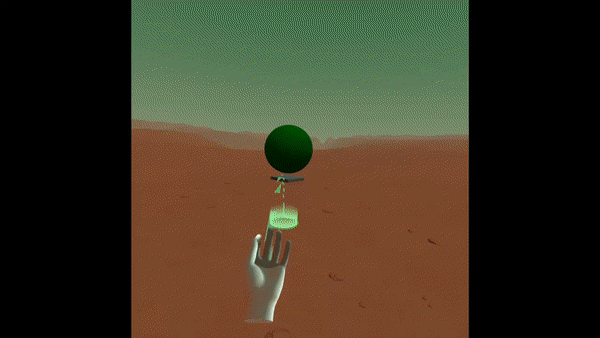

# hand-tracking-controls-extras

Simplified Joints API + utility helpers like a teleporter and world drag:

## How to use it

### Hands in browser:
Enable the experimental feature in the browser (Oculus Browser 11)

    1.  Visit [chrome://flags/](chrome://flags/)
    2.  Enable _WebXR experiences with joints tracking (#webxr-hands)_

Import the script:

    

Add the `hand-tracking-extras` to the hand:
 
    <a-entity id="left-hand" hand-tracking-controls="hand: left; " hand-tracking-extras></a-entity>

Wait for the `hand-tracking-extras-ready` event:

    var hand = document.getElementById("left-hand");
    hand.addEventListener("hand-tracking-extras-ready", (evt) = { 
      var joints = evt.detail.data.joints;
    });

Or grab the joints manually:
    
    var joints = document.getElementById("left-hand").components["hand-tracking-extras"].joints
    var Wrist = joints.Wrist;
    console.log(Wrist.getPosition());
    
Check out the API and the [XRHand docs](https://immersive-web.github.io/webxr-hand-input/#skeleton-joints-section).

### Joints API

Arguments are optional, but providing them will save memory (as otherwise internal helpers are cloned and returned);

Joint object method  | Description
------------- | ------------- 
`getPosition(vector)` | fills the vector with the joint position
`getDirection(vector)` | fills the vector with the normalized direction
`getNormal(vector)` | fills the vector with the normal vector (see image below).
`getRawQuaternion(quaternion)` | fills the quaternion with the raw joint orientation (see image below).
`getQuaternion(quaternion)` | fills the quaternion with a "correct" joint orientation (see image below). 
`getRadius()` | get joint radius
`isValid()` | whether we could read the pose data

#### Visual aid

 getQuaternion (above hand) vs getRawQuaternion (right from hand):

"Normal" blue line

### Joints

From the [WebXR hand docs](https://immersive-web.github.io/webxr-hand-input/#xrjointpose):

Similar to the WebXR hand API, the joints are

Joint name  | XRHand corresponding name (index)
------------- | -------------   
Wrist | XRHand.WRIST (0)
T_Metacarpal | XRHand.THUMB_METACARPAL (1)
T_Proximal | XRHand.THUMB_PHALANX_PROXIMAL (2)
T_Distal | XRHand.THUMB_PHALANX_DISTAL (3)
T_Tip | XRHand.THUMB_PHALANX_TIP (4)
I_Metacarpal | XRHand.INDEX_METACARPAL (5)
I_Proximal | XRHand.INDEX_PHALANX_PROXIMAL (6)
I_Intermediate | XRHand.INDEX_PHALANX_INTERMEDIATE (7)
I_Distal | XRHand.INDEX_PHALANX_DISTAL (8)
I_Tip | XRHand.INDEX_PHALANX_TIP (9)
M_Metacarpal | XRHand.MIDDLE_METACARPAL (10)
M_Proximal | XRHand.MIDDLE_PHALANX_PROXIMAL (11)
M_Intermediate | XRHand.MIDDLE_PHALANX_INTERMEDIATE (12)
M_Distal | XRHand.MIDDLE_PHALANX_DISTAL (13)
M_Tip | XRHand.MIDDLE_PHALANX_TIP (14)
R_Metacarpal | XRHand.RING_METACARPAL (15)
R_Proximal | XRHand.RING_PHALANX_PROXIMAL (16)
R_Intermediate | RHand.RING_PHALANX_INTERMEDIATE (17)
R_Distal | XRHand.RING_PHALANX_DISTAL (18)
R_Tip | XRHand.RING_PHALANX_TIP (19)
L_Metacarpal | XRHand.LITTLE_METACARPAL (20)
L_Proximal | XRHand.LITTLE_PHALANX_PROXIMAL (21)
L_Intermediate | XRHand.LITTLE_PHALANX_INTERMEDIATE (22)
L_Distal | XRHand.LITTLE_PHALANX_DISTAL (23)
L_Tip | XRHand.LITTLE_PHALANX_TIP (24)

### Little disclaimer

When I rushed at `a-frame`s finger tracking I wasn't aware, that I'm kinda reinventing the wheel.
A great place with multiple examples is [Marlon Lückerts repository](https://github.com/marlon360/webxr-handtracking).

On the other hand, I've learned a lot doing this, and am fully willing to continue :)

### Roadmap - wishful thinking

Provide:

0. helper components - stats, and pinch-cursor

1. a simple API for Joints orientation and relations:
    - `.islookingUp()`, `isHorizontallyAligned()`, `.isCloseTo(other)`, `orientedLike(other)`

2. Gesture detection. Define a gesture using the above orientations and relations and let the component do the rest.
